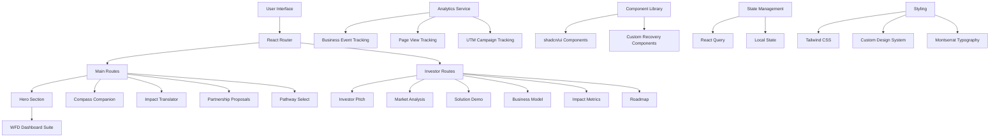

# Recovery Compass 🧭

**AI-Powered Addiction Recovery Platform**

Navigate your environment. Transform your life.

[](https://lovable.dev)
[](https://www.typescriptlang.org/)
[](https://reactjs.org/)
[](https://tailwindcss.com/)

## 📋 Table of Contents

- [Overview](#overview)
- [Architecture](#architecture)
- [Tech Stack](#tech-stack)
- [Dependencies](#dependencies)
- [Project Structure](#project-structure)
- [Key Features](#key-features)
- [Development Setup](#development-setup)
- [Deployment](#deployment)
- [Analytics & SEO](#analytics--seo)
- [Brand Guidelines](#brand-guidelines)
- [Contributing](#contributing)
- [License](#license)

## 🎯 Overview

Recovery Compass is a comprehensive AI-powered platform democratizing addiction recovery through intelligent environmental navigation and personalized support systems. Founded by Eric Brakebill Jones, MSW (Cal State LA's first student-founder), the platform addresses the critical treatment gap affecting 77% of the 48.5M Americans with substance use disorders.

### Mission Statement
Transforming addiction recovery through evidence-based AI technology that empowers individuals to navigate their recovery environment with precision and confidence.

## 🏗️ Architecture



### Core Architecture Principles

- **Component-Based**: Modular React components for maximum reusability
- **Type Safety**: Full TypeScript implementation with strict type checking
- **Responsive Design**: Mobile-first approach with progressive enhancement
- **Performance Optimized**: Code splitting, lazy loading, and optimized bundle sizes
- **Analytics-Driven**: Comprehensive tracking for business intelligence
- **Accessibility**: WCAG 2.1 compliant with trauma-informed design principles

## 🛠️ Tech Stack

### Frontend Framework
- **React 18.3.1** - Modern React with concurrent features
- **TypeScript** - Type-safe JavaScript with enhanced developer experience
- **Vite** - Lightning-fast build tool and development server

### Routing & Navigation
- **React Router DOM 6.26.2** - Declarative routing for React applications

### Styling & UI
- **Tailwind CSS** - Utility-first CSS framework
- **shadcn/ui** - High-quality accessible component library
- **Radix UI** - Low-level UI primitives for accessibility
- **Montserrat Font** - Primary brand typography

### State Management
- **TanStack React Query 5.56.2** - Powerful data synchronization for React
- **Zustand 5.0.5** - Lightweight state management solution

### Animation & Interactions
- **Framer Motion 12.14.0** - Production-ready motion library
- **Lucide React 0.462.0** - Beautiful & consistent icon library

### Data Visualization
- **Recharts 2.12.7** - Composable charting library for React

### Development Tools
- **ESLint** - JavaScript/TypeScript linting
- **PostCSS** - CSS transformation tool
- **Class Variance Authority** - Type-safe variant management

## 📦 Dependencies

### Core Dependencies
```json
{
  "react": "^18.3.1",
  "react-dom": "^18.3.1",
  "react-router-dom": "^6.26.2",
  "typescript": "latest",
  "@tanstack/react-query": "^5.56.2"
}
```

### UI & Styling
```json
{
  "tailwindcss": "latest",
  "tailwind-merge": "^2.5.2",
  "tailwindcss-animate": "^1.0.7",
  "class-variance-authority": "^0.7.1",
  "clsx": "^2.1.1",
  "framer-motion": "^12.14.0"
}
```

### Radix UI Components
```json
{
  "@radix-ui/react-accordion": "^1.2.0",
  "@radix-ui/react-dialog": "^1.1.2",
  "@radix-ui/react-navigation-menu": "^1.2.0",
  "@radix-ui/react-toast": "^1.2.1",
  "@radix-ui/react-tooltip": "^1.1.4"
}
```

### Icons & Visualization
```json
{
  "lucide-react": "^0.462.0",
  "recharts": "^2.12.7"
}
```

### Form Handling
```json
{
  "react-hook-form": "^7.53.0",
  "@hookform/resolvers": "^3.9.0",
  "zod": "^3.23.8"
}
```

## 📁 Project Structure

```
src/
├── components/          # Reusable UI components
│   ├── ui/             # shadcn/ui components
│   ├── CompassLogo.tsx # Brand logo component
│   ├── HeroSection.tsx # Landing page hero
│   ├── Navigation.tsx  # Main navigation
│   └── wfd-suite/      # WFD Dashboard components
├── pages/              # Route-level components
│   ├── Index.tsx       # Home page
│   ├── InvestorPitch.tsx
│   ├── MarketAnalysis.tsx
│   └── ...
├── lib/                # Utility libraries
│   ├── analytics.ts    # Analytics service
│   └── utils.ts        # General utilities
├── hooks/              # Custom React hooks
├── App.tsx             # Main application component
├── main.tsx           # Application entry point
└── index.css          # Global styles & design system
```

## ✨ Key Features

### Core Platform Features
- **Compass Companion**: AI-powered recovery guidance system
- **Impact Translator**: Evidence-based outcome measurement
- **Partnership Proposals**: Healthcare integration platform
- **Pathway Select**: Personalized recovery journey mapping

### Investor Relations Suite
- **Market Analysis**: Comprehensive addiction treatment market data
- **Solution Demo**: Interactive platform demonstrations
- **Business Model**: Revenue streams and scalability metrics
- **Impact Metrics**: Real-world outcomes and success stories
- **Roadmap**: Technology development timeline

### Technical Features
- **Progressive Web App**: Offline-capable with service worker support
- **Responsive Design**: Optimized for mobile, tablet, and desktop
- **Analytics Integration**: Business intelligence and user behavior tracking
- **SEO Optimization**: Server-side rendering and meta tag management
- **Performance Monitoring**: Core Web Vitals tracking
- **Accessibility**: WCAG 2.1 AA compliance with trauma-informed design

## 🚀 Development Setup

### Prerequisites
- **Node.js** 18+ (recommended: use [nvm](https://github.com/nvm-sh/nvm))
- **npm** or **yarn** package manager

### Installation

1. **Clone the repository**
   ```bash
   git clone <repository-url>
   cd recovery-compass
   ```

2. **Install dependencies**
   ```bash
   npm install
   ```

3. **Start development server**
   ```bash
   npm run dev
   ```

4. **Open in browser**
   ```
   http://localhost:8080
   ```

### Development Commands

```bash
# Development server with hot reload
npm run dev

# Build for production
npm run build

# Preview production build
npm run preview

# Lint code
npm run lint

# Type check
npm run type-check
```

### Environment Configuration

The application supports environment-specific configuration:

- **Development**: Analytics disabled by default
- **Production**: Full analytics and performance monitoring
- **UTM Tracking**: Automatic campaign parameter detection

## 🚀 Deployment

### Lovable Platform (Recommended)
1. Click the **Publish** button in the Lovable editor
2. Your app will be deployed to `yourproject.lovable.app`

### Custom Domain
1. Navigate to **Project > Settings > Domains** in Lovable
2. Connect your custom domain
3. Follow DNS configuration instructions

### Self-Hosting Options
The codebase is standard React/Vite and can be deployed to:
- **Vercel**: Zero-configuration deployment
- **Netlify**: Continuous deployment from Git
- **AWS S3 + CloudFront**: Enterprise-grade hosting
- **Docker**: Containerized deployment

## 📊 Analytics & SEO

### Analytics Implementation
- **Privacy-Compliant**: Respects DNT headers and user consent
- **Business Intelligence**: Custom event tracking for key metrics
- **Campaign Tracking**: UTM parameter support for marketing attribution
- **Performance Monitoring**: Core Web Vitals and user experience metrics

### SEO Optimization
- **Meta Tags**: Dynamic title and description management
- **Structured Data**: JSON-LD schema for healthcare organizations
- **Sitemap**: Automated sitemap generation
- **Robots.txt**: Search engine crawler guidance

### Key Metrics Tracked
- **Journey Initiation**: Recovery pathway selections
- **Investor Engagement**: Pitch deck interactions
- **Partnership Inquiries**: B2B lead generation
- **Demo Requests**: Product demonstration engagement

## 🎨 Brand Guidelines

### Typography System
- **Primary Font**: Montserrat (Google Fonts)
- **Brand Headlines**: Montserrat Black (900)
- **Body Text**: Montserrat Regular (400)
- **Emphasis**: Montserrat Medium (500)
- **Light Text**: Montserrat Light (300)

### Color Palette
```css
/* Recovery Compass Brand Colors */
--navy: #101534;      /* Primary dark background */
--bronze: #D4AF37;    /* Primary accent and CTA */
--teal: #5DADE2;      /* Secondary accent */
--gold: #F4D03F;      /* Tertiary accent */
--moonlight: #F8F9FA; /* Primary text on dark */
```

### Design Principles
- **Trauma-Informed**: Calming colors and non-triggering imagery
- **Accessibility First**: WCAG 2.1 AA compliance minimum
- **Mobile-Responsive**: Touch-friendly interfaces with 44px minimum targets
- **Performance-Conscious**: Optimized images and progressive loading

## 🤝 Contributing

### Development Guidelines
1. **Type Safety**: All new code must include proper TypeScript types
2. **Component Architecture**: Create small, focused, reusable components
3. **Accessibility**: Ensure keyboard navigation and screen reader support
4. **Testing**: Include unit tests for complex business logic
5. **Performance**: Optimize bundle size and runtime performance

### Code Style
- **ESLint**: Automated linting with project configuration
- **Prettier**: Consistent code formatting
- **Conventional Commits**: Structured commit messages
- **Component Naming**: PascalCase for components, camelCase for utilities

### Pull Request Process
1. Fork the repository
2. Create a feature branch
3. Implement changes with tests
4. Submit pull request with detailed description
5. Code review and approval process

## 📄 License

This project is proprietary software owned by Recovery Compass. All rights reserved.

For licensing inquiries, please contact: [legal@recoverycompass.ai]

## 📞 Contact

**Recovery Compass**
- **Founder**: Eric Brakebill Jones, MSW
- **Website**: [recoverycompass.ai]
- **Email**: [hello@recoverycompass.ai]
- **LinkedIn**: [Recovery Compass Company Page]

**Technical Support**
- **Documentation**: [docs.recoverycompass.ai]
- **Developer Portal**: [developers.recoverycompass.ai]
- **Issue Tracking**: [GitHub Issues]

---

**Built with ❤️ for the recovery community**

*Recovery Compass is democratizing addiction recovery through AI-powered environmental navigation, serving the 48.5M Americans affected by substance use disorders with evidence-based, trauma-informed technology solutions.*
